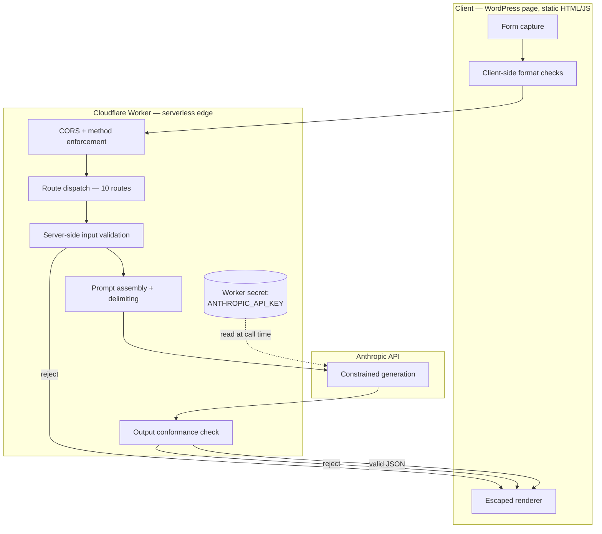

# Architecture — AI Security Tooling Platform

## Design goals

1. **No credential ever reaches the browser.** The single non-negotiable constraint.
2. **Model output is a contract, not prose.** Every route defines a schema; the frontend
   renders fields, not free text.
3. **Sub-15-second response.** Users abandon a security tool that behaves like a batch job.
4. **No analysis retention.** Users paste real logs and live policies; the safest storage
   posture is none.
5. **Frontend and Worker decoupled.** Schema changes that reduce output volume should not
   require a frontend deploy.

## Component overview



## Why a Worker rather than a traditional backend

**Credential placement is the actual requirement**, and any server-side component satisfies
it. The Worker was chosen for secondary reasons:

- Execution at edge locations reduces round-trip latency, which matters given the model
  call already dominates the response budget.
- No always-on compute to patch, monitor, or pay for during idle periods.
- Secrets management is built in rather than bolted on.

The tradeoff: Workers have execution-time and memory limits, which rules out long-running
analysis. Every route is designed to complete within a single request/response cycle.

## Route structure

All ten tools share one Worker and dispatch on pathname. Each route supplies:

- a **system prompt** encoding domain expertise and output schema
- a **max_tokens budget** sized to worst-case output for that schema
- a **validation function** for its specific input shape
- an **output conformance check**

Sharing one Worker keeps deployment simple and CORS configuration in one place. The cost is
blast radius: a bad deploy affects all ten tools simultaneously. At larger scale these would
split into separately deployed Workers behind a router.

## Token budgeting

Budget selection is a reliability concern, not a cost concern. A response that exceeds its
budget terminates mid-object, producing JSON that fails to parse — which surfaces to the
user as a broken report rather than an error message.

Two routes were originally provisioned at 4000 tokens with verbose system prompts. That
combination sat close enough to the ceiling that variance in output length created
truncation risk. Both were addressed by:

1. Trimming the system prompt rather than the schema
2. Reducing bounded output counts (ATT&CK Mapper: 8–12 techniques → 6–8)
3. Lowering the budget to 3000

Schema fields were preserved throughout — the report structure stayed identical, only its
length changed. This is why the change required no frontend work.

## Rendering contract

The frontend guards every section independently:

```javascript
if (d.attack_techniques && d.attack_techniques.length) { /* render */ }
```

A response missing an optional section renders a shorter report. This is the property that
decoupled the token-budget work from the frontend, and it is worth preserving as new routes
are added.

Every model-returned string passes through `esc()` before DOM insertion. See
[threat-model.md](threat-model.md) T-02.

## Known architectural debt

- The Worker retains a name scoped to the first tool built, though it now serves ten routes.
- Lead capture posts from the client to a third-party relay rather than through the Worker.
- No schema versioning; frontend and Worker assume lockstep deploys.
- No rate limiting on a publicly reachable, unauthenticated endpoint.

These are tracked in the README roadmap.
